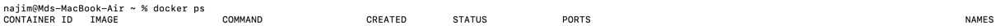
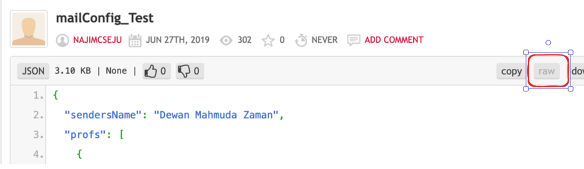
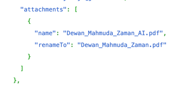
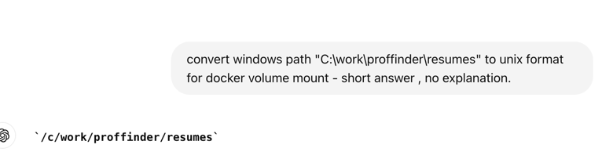

# How to use:
## Install docker on your machine:
- For the ease of usage the solution has been based on docker.
- Install docker in your OS, it's just as installing a new software. **Please take note, docker (and hence this solution) may not work on windows laptop with 4GB Ram. The recommended is at least 6GB or 8GB of RAM**. 
- Open cmd(windows) / terminal on linux or mac and make sure docker is running by making `sure docker ps -a` command.  If everything ok , then the first line of output should look like this -

- There are an enormous number of blogs that explains how to install docker on your OS, so please make sure you follow one of them and are able to run docker successfully on your machine.

## Generate Google App Password:
Now this solution is mail provider-agnostic, because it uses username and password authentication for SMTP, so any email that supports username-password authentication on SMTP can be used. However, it is tested on gmail only. 

- Now to use APP password from google we need to enable 2FA first. 
- After enabling 2FA we can generate app password. Unfortunately, google keeps changing way to generate APP password. As of writing this document, this url has worked for me. If it does not work, then watch some recent youtube video or read some recent blogs.
- As of this documentation, this url `https://myaccount.google.com/apppasswords ` serves well, assuming 2-fa is enabled. 
- _take note of the apppassword_
## Preparing the email content:
- Prepare a JSON document like this, `vscode` is a very good json editor compatible to all OS. `notepad++` is also very good options for windows.
- Upload it in pastebin as public content, **make sure you don't put any sensitive data in the json which can not be exposed publicly**.
- Then collect the **raw** url of the json like this, https://pastebin.com/raw/wqV7a26w , make sure you copied the url with /raw.
-  - click here and it will open the raw json view. Just the full url from the browsers search bar.

## Gather all your resumes in your local machine:
This app allows you to use a folder with different CVs with different content targeting different domain professors, e.g CV_MD_NAJIM_AHMED_DATA_SCIENCE,CV_MD_NAJIM_AHMED_NETWORKING,CV_MD_NAJIM_AHMED_CLOUD_COMPUTING etc. put all your resumes in a folder, copy the path of that folder, and _keep note of that_. Please don't forget to mention in the configuration how these resumes are to be renamed before sending to the professor. You do this in following way - 

Here,according to json configuration file in the example, resume Dewan_Mahmuda_Zaman_AI.pdf will be renamed to Dewan_Mahmuda_Zaman.pdf before sending to professor.

## Converting CV folder's path on windows:
Let's assume you are on windows and your resumes are in the folder C:\work\proffinder\resumes. you have to change it to /c/work/proffinder/resumes. **Take a note of the converted path.** The easiest way to use bard or chatgpt with prompt`convert windows path "C:\work\proffinder\resumes" to unix format for docker volume mount - short answer , no explanation.` It should like this - 
**For linux or mac we can skip this step.**
## Finally, Triggering automatic email:
Now in the following command change the parameters you took note of and then run the command. If everything works fine, you should see a draft of the email, if you like the draft, press y and the email will be sent!
docker run -it --rm \
-e EMAIL=YOUR_EMAIL_UNDER_WHICH_YOU_GENERATED_THE_APP_PASSWORD \
-e PASSWORD="YOUR_APP_PASSWORD_THAT_YOU_TOOK_NOTE_OF" \
-e URL=YOUR_CONFIG_FILE_PATH_THAT_YOU_TOOK_NOTE_OF \
-v PATH_TO_THE_FOLDER_WHERE_ALL_THE_RESUMES_ARE_LINUX_FILESYSTEM_FORMAT_THAT_YOU_TOOK_NOTE_OF:/app/config \
ivplay4689/proffinder

## Note:
- Our research suggested that the best time to send email to the professors is 30 minute before their office time. So run this app according to that time. This ensures, when professors open their mailbox, your email is on top. This increases your chance to open and read your email by the professor.
- The first 10 users of the system will be personally supported by be via whatsapp number +60176351672 given that this will be published under the following section `In person help`. Please take note, by sending me issues via whatsapp you agree that the problem you faced and the solution it required will be published as described. No other information e.g your name/phone number will be published.

## In person help:
- Root cause:
- Solution